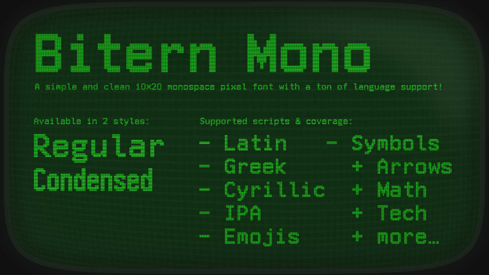
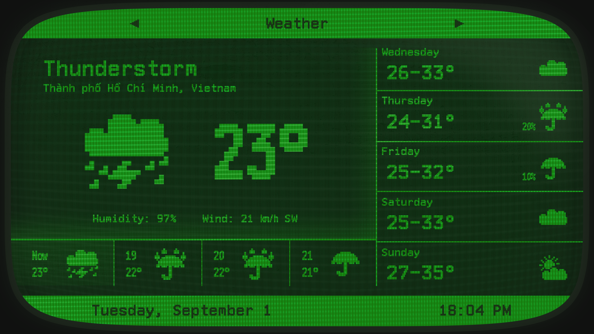

# Bitern-Mono

Bitern Mono is a simple and clean 10×20 monospace pixel font, created using [FontStruct](https://fontstruct.com/fontstructions/show/2259749/bitern-mono).

## License

Bitern Mono is licensed under OFL-1.1, see details [here](https://github.com/Catterio/Bitern-Mono?tab=OFL-1.1-1-ov-file).

## Download

You can download the font via the [latest release](https://github.com/Catterio/Bitern-Mono/releases/latest).

## Language support

The font supports 114 languages, as detected by [FontDrop's language report](https://fontdrop.info/#/languages?darkmode=true).

Azerbaijani, Belarusian, Bosnian, Bulgarian, Chechen, Macedonian, Ossetic, Russian, Sakha, Serbian, Ukrainian, Uzbek, Greek, Afrikaans, Aghem, Akan, Albanian, Asturian, Asu, Bafia, Basaa, Basque, Bemba, Bena, Breton, Catalan, Chiga, Colognian, Cornish, Croatian, Czech, Danish, Duala, Dutch, Embu, English, Esperanto, Estonian, Ewe, Ewondo, Faroese, Filipino, Finnish, French, Friulian, Fulah, Galician, Ganda, German, Gusii, Hawaiian, Hungarian, Icelandic, Igbo, Inari Sami, Indonesian, Irish, Italian, Jola- Fonyi, Kabuverdianu, Kabyle, Kako, Kalaallisut, Kalenjin, Kamba, Kikuyu, Kinyarwanda, Koyraboro Senni, Koyra Chiini, Kwasio, Lakota, Langi, Latvian, Lingala, Lithuanian, Lower Sorbian, Luba-Katanga, Luo, Luxembourgish, Luyia, Machame, Makhuwa-Meetto, Makonde, Malagasy, Maltese, Manx, Masai, Meru, Meta', Morisyen, Mundang, Nama, Ngiemboon, Northern Sami, North Ndebele, Norwegian Bokmål, Norwegian Nynorsk, Nuer, Nyankole, Oromo, Polish, Portuguese, Prussian, Quechua, Romanian, Romansh, Rombo, Rundi, Rwa, Samburu, Sango, Sangu, Scottish Gaelic, Sena, Serbian, Shambala, Shona, Slovak, Slovenian, Soga, Somali, Spanish, Swahili, Swedish, Swiss German, Tachelhit, Taita, Tasawaq, Teso, Tongan, Turkish, Upper Sorbian, Uzbek (Latin), Vai, Vietnamese, Volapük, Vunjo, Walser, Welsh, Western Frisian, Yangben, Yoruba, Zarma, Zulu.
